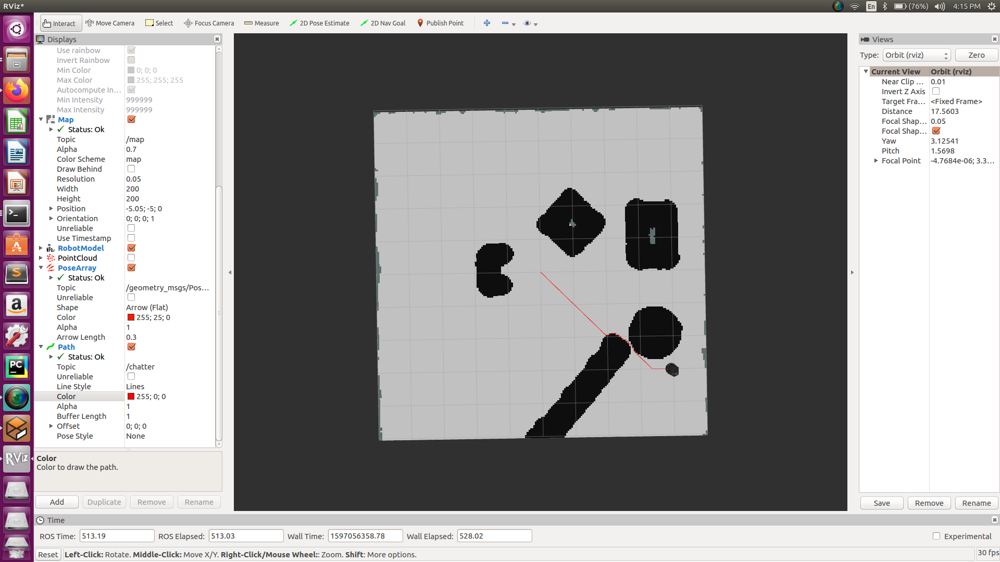

# __A* algorithm implementation__

A star algorithm is one of the most optimal path planning alogrithm in static environments.
In this project, an A* algorithm was employed to find optimal path between two given points of static map of the environment.
Also, a proportional controller was used for motion of the bot on the obtained path.

- Simulation was done on Gazebo simulator (version 7.0.0).
- Static grid based map was created using costmap_2d package.Obstacles were inflated with help of costmap node parameters.
- A* algorithm was developed using rospy and numpy libraries only.
- Proportional controller uses odometry data to give commands for the motion of turtlebot on the obtained path.

Map with obtained path displayed in rviz:

	start location : (0,0)
	Goal location : (-3,-4)

 

